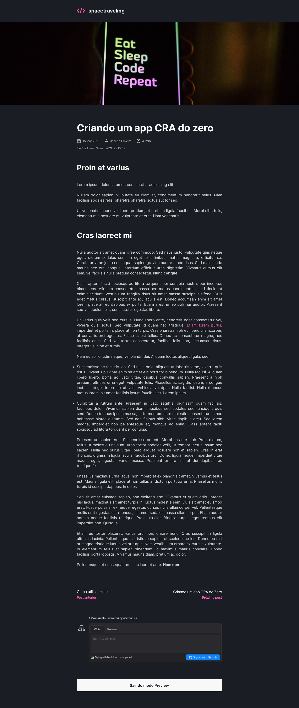

<h2 align="center">
  
</h2>

<p align="center">
  <a href="#dart-sobre">Sobre</a> &#xa0; | &#xa0;
  <a href="#tv-preview">Preview</a> &#xa0; | &#xa0;
  <a href="#rocket-tecnologias">Tecnologias</a> &#xa0; | &#xa0;
  <a href="#gear-configurações">Configurações</a> &#xa0; | &#xa0;
  <a href="#memo-autor">Autor</a> &#xa0; &#xa0;
</p>


# :dart: Sobre

O projeto tem como objetivo o estudo e desenvolvimento de uma aplicação em ReactJS com NextJS para listagem de posts e sistema de inscrição.

Essa é uma aplicação onde o seu principal objetivo foi criar um blog do zero. Consumindo os dados do Prismic e ter a interface implementada conforme o layout do Figma. Essa aplicação é um desafio do bootcamp Ignite da [Rocketseat](https://rocketseat.com.br/).

A aplicação foi desenvolvida utilizando o framework NextJS aplicando conceitos como:

  - Consumo de API externas
  - API Root
  - Static Site Generation (SSG)
  - Prismic CMS.
  - Comentários com Utteranc


---

# :tv: Preview
<div>
   
   
   <!--  -->
</div>

---

# :rocket: Tecnologias

- [Next.js](https://nextjs.org/)
- [TypeScript](https://www.typescriptlang.org/)
- [SASS](https://sass-lang.com/)
- [Prismic CMS](https://prismic.io/)
- [Utteranc](https://prismic.io/)

---

# :gear: Configurações

## 💾 Instalar:

- Yarn
- Stripe CLI

Criar conta e configurar os serviços externos:

- Stripe
- FaunaDB
- Prismic CMS

## ✍ Clone do projeto

```bash
# Execute o comando git clone para realizar o clone do repositório
$ git clone https://github.com/marcos-hein/spacetraveling.git
# Entre na pasta do repositório clonado
$ cd spacetraveling
```
## 🏁 Iniciando o projeto

```bash
# Execute yarn para instalar as dependências
$ yarn

# Na raiz do projeto crie uma copia do arquivo .env.local.example
# Altere o nome da copia para .env.local
# Preencha as variáveis ambiente de acordo com as instruções
$ cp .env.local.example .env.local

# Para iniciar a aplicação
$ yarn dev
```
---
## :memo: Autor
Desenvolvido por **Marcos Vinicius Hein Pereira**
